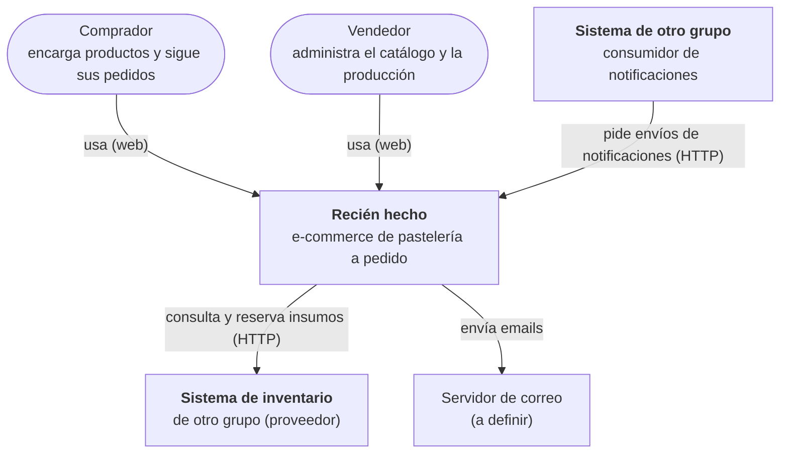
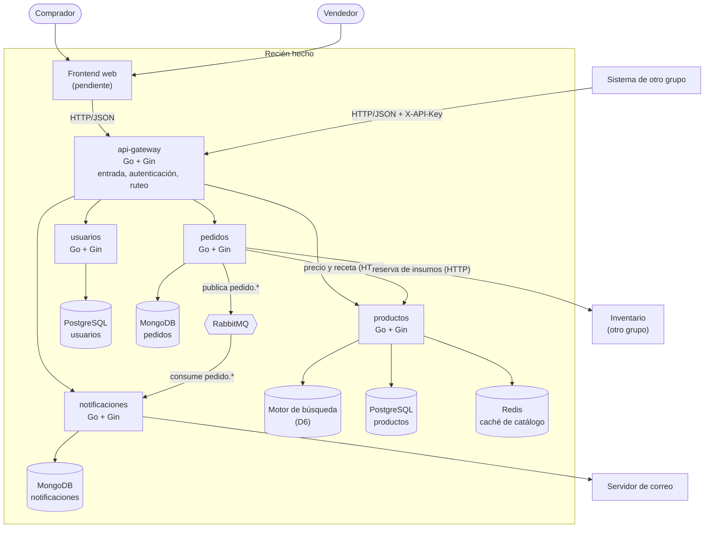
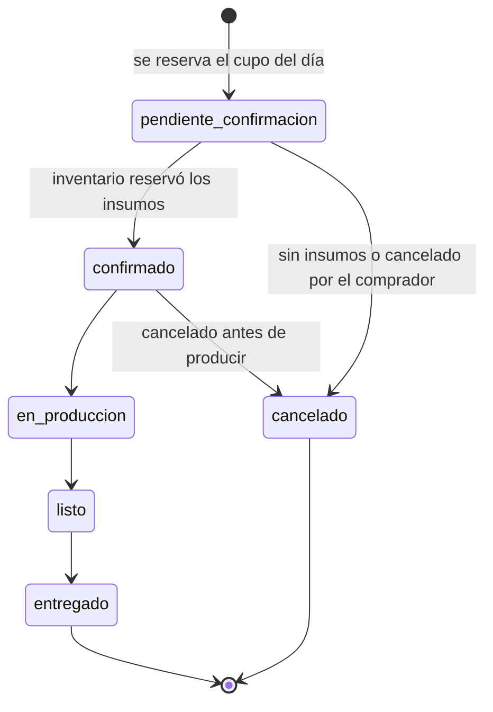

# Arquitectura

Versión preliminar (Entrega 1). Las decisiones que la sostienen están en [docs/adr/](adr/).

## Visión general

Recién hecho es un e-commerce de pastelería a pedido. Los compradores encargan productos para ahora, para una fecha futura o a medida, y la pastelería organiza su producción según la capacidad que tiene cada día.

El backend son cuatro microservicios en Go (Gin) detrás de un api gateway, orquestados con Docker Compose. El sistema publica una capacidad para otro grupo (**notificaciones**) y consume la de otro grupo (**inventario**).

### Diagrama de contexto

### Diagrama de contenedores

Las bases, la caché y el broker están propuestos ([ADR-002](adr/ADR-002-persistencia.md), [ADR-003](adr/ADR-003-comunicacion-entre-servicios.md)) y todavía no están en el `docker-compose`.

## Servicios

Cada servicio es el único dueño de sus datos ([ADR-001](adr/ADR-001-limites-de-los-servicios.md)).

| Servicio | Puerto | Responsabilidad | Datos propios | Expone |
|---|---|---|---|---|
| api-gateway | 8080 | Punto de entrada único, autenticación, ruteo | Ninguno | Todas las rutas públicas |
| usuarios | 8081 | Registro, login, roles comprador/vendedor | Cuentas, roles, contraseñas hasheadas | Registro, login, perfil |
| productos | 8082 | Catálogo, búsqueda, recetario | Productos, precios (centavos), imágenes, recetas | Catálogo, búsqueda, ABM (vendedor) |
| pedidos | 8083 | Pedidos inmediatos, programados y especiales; calendario y capacidad de producción | Pedidos y estados, cupos por día | Crear y seguir pedidos, calendario (vendedor) |
| notificaciones | 8084 | Envío de avisos a compradores y a usuarios de otros grupos | Notificaciones, estados, claves de idempotencia | [Contrato v1](contracts/notificaciones-v1.yaml) |

La capacidad de producción vive en `pedidos` porque reservar el cupo y crear el pedido tienen que ser una sola operación atómica: es la operación del sistema que no puede duplicar ni perder información.

Estructura de cada servicio, hoy: `services/<servicio>/` con su propio `go.mod`, `main.go` (solo `/health`) y `Dockerfile`. Ningún servicio importa código de otro. La arquitectura interna de cada uno (D2) se define en la Entrega 2.

### Estados de un pedido

Los pedidos especiales pasan antes por `solicitado` → `cotizado` y de ahí a `aceptado` (sigue como `pendiente_confirmacion`), `rechazado` o `vencido` (48 h sin respuesta del comprador).

## Datos

| Servicio | Almacenamiento | Motivo |
|---|---|---|
| usuarios | PostgreSQL | Datos tabulares, email único |
| productos | PostgreSQL + Redis | Filtros sobre el catálogo; se lee mucho y cambia poco |
| pedidos | MongoDB | Pedido como documento con sus ítems; campos libres en pedidos especiales |
| notificaciones | MongoDB | Documentos simples, índice único de idempotencia |

Montos siempre en centavos (`int64`). Detalle y limitaciones en [ADR-002](adr/ADR-002-persistencia.md).

## Comunicación entre servicios

- **Síncrona (HTTP/JSON):** frontend y otros grupos → api-gateway → servicios; `pedidos` → `productos` (precio y receta); `pedidos` → inventario del otro grupo. Con timeouts y reintentos solo en operaciones idempotentes.
- **Asíncrona (RabbitMQ):** `pedidos` publica `pedido.confirmado` y `pedido.estado_cambiado`; `notificaciones` los consume y avisa al comprador.

Valores y reglas en [ADR-003](adr/ADR-003-comunicacion-entre-servicios.md).

## Mensajería y eventos

Exchange `pedidos` (topic), cola `notificaciones.pedidos`, DLQ `notificaciones.fallidos`, consumidor idempotente por `idEvento`. Se implementa en la Entrega 2.

## Observabilidad

Pendiente (D11, Entrega 2): logs estructurados con id de correlación, métricas, trazas y tablero.

## Integraciones externas

| Integración | Rol | Servicio responsable | Estado |
|---|---|---|---|
| Notificaciones | Publicamos | notificaciones (vía api-gateway) | Contrato v1 + mock ([docs/contracts](contracts/README.md), [ADR-004](adr/ADR-004-contrato-de-notificaciones.md)) |
| Inventario | Consumimos | pedidos | Esperando el contrato del otro grupo (D9) |
